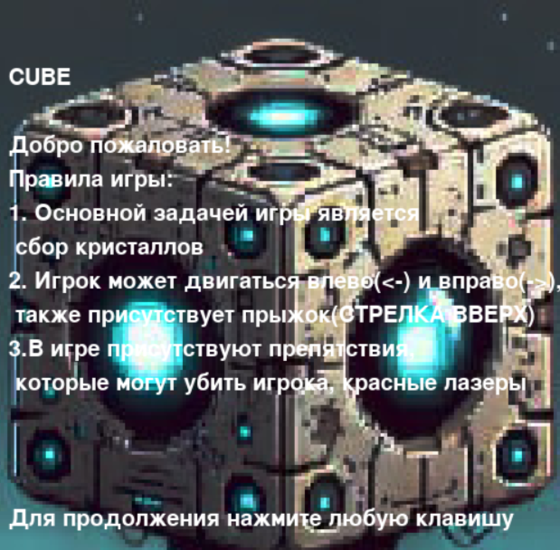

# Пояснительная записка

## Название проекта
CUBE

## Авторы проекта
Пухаев Георгий

Мамсуров Абисал

## Аннотация
Техническое задание: Игра-платформер с сюжетом "Кубо-Портал"
Описание игры
"Кубо-Портал" - это платформер с оригинальной механикой телепортации, дополненный небольшим сюжетом. Игрок управляет персонажем (кубом-роботом по имени Кубо), которому предстоит восстановить свой разрушенный мир, собирая энерго-кристаллы и используя портал-технологии. На каждом уровне Кубо сталкивается с уникальными вызовами и узнает фрагменты истории о прошлом мира.

### Сюжет
Пролог:
Когда-то мир Кубо был источником бесконечной энергии, питаемой кристаллами. Но из-за катастрофического сбоя в портальной технологии кристаллы разбросало по всему миру, а баланс энергии нарушился. Теперь Кубо, последний из ремонтных дронов, должен восстановить энергетическую сеть, собирая кристаллы и восстанавливая порталы.

### Основные элементы сюжета:

Катастрофа: Кубо узнаёт, что портал-технология была перегружена жадностью создателей, которые пытались получить больше энергии, чем было безопасно.
Новые угрозы: На пути появляются автоматические охранные системы, активированные после сбоя, и обломки старых технологий.
Кульминация: В конце игры Кубо понимает, что для полного восстановления энергии он должен пожертвовать своим источником питания, чтобы завершить миссию.
Игровые особенности

### Механики:

- Игрок может телепортироваться с помощью порталов, которые стоят на локации.
- Кристаллы обязательны для сбора на уровне, чтобы открыть портал на следующий уровень.
- Препятствия: шипы, лазеры, движущиеся платформы, охранные дроны.
- Активные элементы: рычаги, открывающие двери, поднимающие платформы.
- Энергетические барьеры: закрывают путь и отключаются после активации кристаллов.
  
Прогресс:

На каждом уровне игрок собирает кристаллы, чтобы восстановить энергию.
Уровни постепенно усложняются: больше ловушек, меньше безопасных зон для порталов.
В финале добавляется таймер: уровень нужно пройти до полного обрушения системы.
Технические требования
Платформа: Игра должна быть написана на Pygame.

### Графика
Простая пиксельная графика:

Кубо — робот в форме куба.
Локации — заброшенные технологические лаборатории, разрушенные энергетические поля.
Порталы — анимированные круги с эффектами.

### Аудио

Фоновая музыка для создания атмосферы заброшенного мира.
Звуковые эффекты: активация портала, сбор кристаллов, столкновение с препятствиями.

### Структура уровней
- Введение:

Простой уровень, знакомящий игрока с механикой порталов.
Минимум препятствий.

- Углубление:

Добавляются движущиеся платформы, охранные дроны и больше кристаллов для сбора.

- Кульминация:

Уровень с ограничением времени, сложными препятствиями и финальным решением Кубо.

## Руководство администратора
Для запуска проекта достаточно запустить файл cubegame.exe.

## Руводство пользователя
При запуске приложения открывается заставка игры, далее для продолжения нужно нажать любую клавишу на клавиатуре.

Далее начинается сам уровней. На нём бывает три типа объектов:
1. Кристаллы - их надо собирать для прохождение уровня
2. Порталы
3. Энергетические дыры - если на них наступить вы погибните

   
   

Управление игрой:
Стрелка вверх - Прыжок 
Стрелка влево - Идти влево
Стрелка вправо - Идти вправо
R - Перезапустить уровень

## Руководство программиста
В игре присутствуют 6 файлов:
  1. main.py - отвечает за начальную заставку и открытие уровня
  2. level.py - отвечает за генерацию и хранение данных на уровне, внутри этого файла реализован класс Level
  3. player.py - файл, отвечающий за персонажа в том числе за его соприкосновенеие с объектами. Внутри имеется класс player
  4. crystal.py - спрайт кристала
  5. platforms.py - спрайт платформы
  6. spike.py - спрайт энергетической дыры

## Заключение
Мы реализовали проект, предназназначенный сугубо для развлекательных целей.

## Список используемой литературы и сайтов

- yandex.lms
- google.com
- yander.ru
- chatgpt.com
- https://alice.yandex.ru/
- https://chat.deepseek.com/
